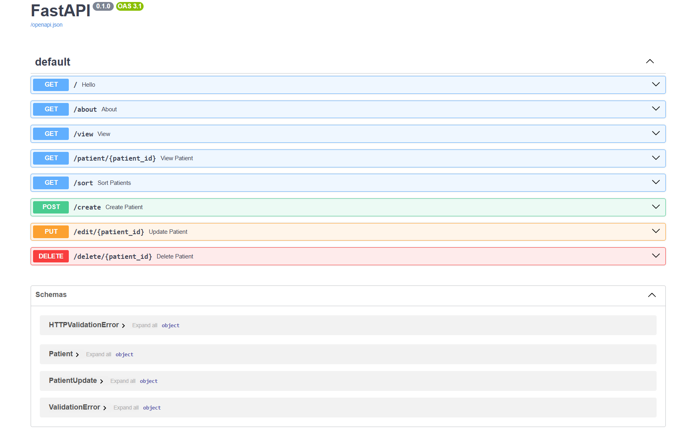

# 🏥 Patient Management System API

A RESTful API built with **FastAPI** to manage patient records, including automatic BMI calculation and health verdicts.

## 🚀 Features

- Add, view, update, and delete patient records
- Auto-calculates **BMI** and gives a health **verdict** (Underweight / Normal / Overweight / Obese)
- Sort patients by height, weight, or BMI
- Data stored in a local JSON file

## 🛠️ Tech Stack

- Python
- FastAPI
- Pydantic v2
- Uvicorn

## 📦 Installation
```bash
# Clone the repository
git clone https://github.com/krpranav7/patient-management-api.git
cd patient-management-api

# Create virtual environment
python -m venv myenv
myenv\Scripts\activate  # On Windows

# Install dependencies
pip install -r requirements.txt
```

## ▶️ Run the API
```bash
uvicorn main:app --reload
```

Then open: [http://127.0.0.1:8000/docs](http://127.0.0.1:8000/docs) for the interactive Swagger UI.

## 📷 API Documentation Preview

Below is the interactive Swagger UI generated by FastAPI for testing and exploring all API endpoints.

<p align="center">
  
</p>

## 📌 API Endpoints

| Method | Endpoint | Description |
|--------|----------|-------------|
| GET | `/` | Welcome message |
| GET | `/about` | About the API |
| GET | `/view` | View all patients |
| GET | `/patient/{id}` | Get patient by ID |
| GET | `/sort` | Sort patients by field |
| POST | `/create` | Add a new patient |
| PUT | `/edit/{id}` | Update patient info |
| DELETE | `/delete/{id}` | Delete a patient |

## 📄 Sample Patient Object
```json
{
  "id": "P001",
  "name": "Ananya Sharma",
  "city": "Guwahati",
  "age": 28,
  "gender": "female",
  "height": 1.65,
  "weight": 90.0
}
```

## 📊 BMI Verdict Logic

| BMI Range | Verdict |
|-----------|---------|
| < 18.5 | Underweight |
| 18.5 – 24.9 | Normal |
| 25 – 29.9 | Overweight |
| ≥ 30 | Obese |